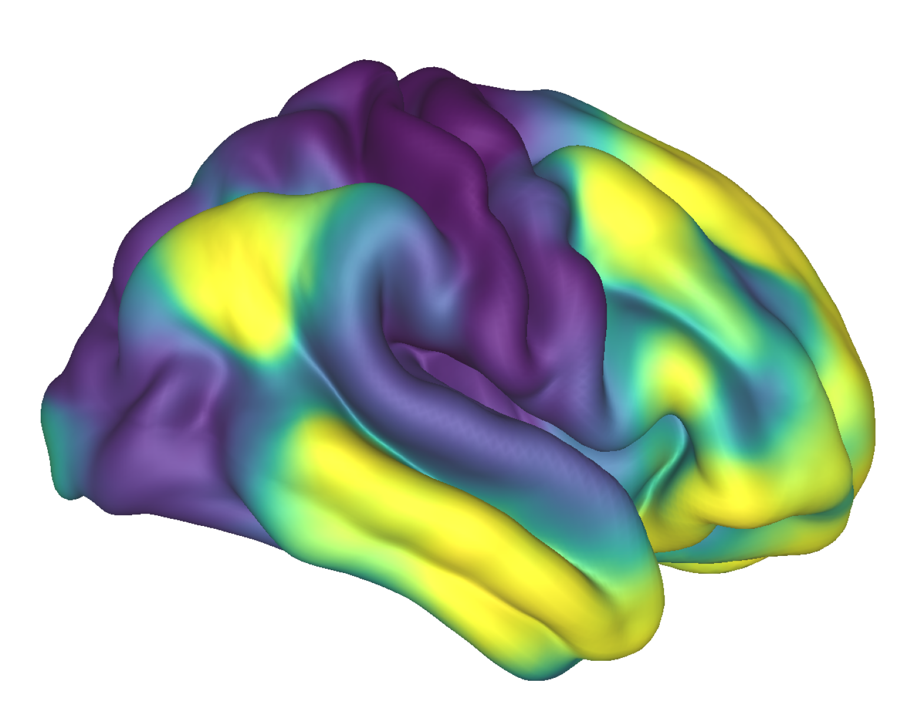
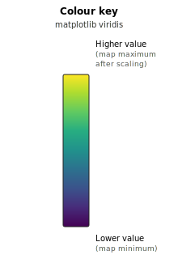
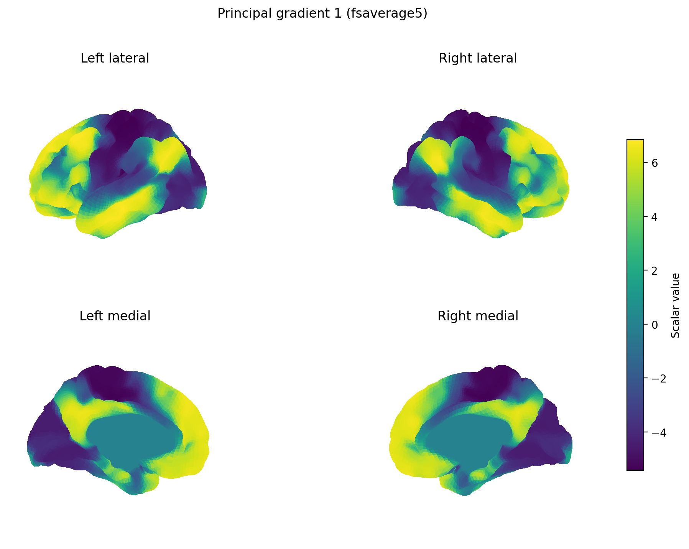

# Freidrich et al. — study folder

This folder holds materials related to **cortical functional gradients** and their use alongside **interhemispheric** anatomy. The cortical input is the same *kind* of data described in Margulies et al. (2016): a **principal gradient** of resting-state functional connectivity, running from **unimodal / sensory–motor** cortex toward **transmodal / default-mode–associated** cortex.

---

## Cortical visualisation (`hcp_gradients_cerebro.png`)

This image is produced with the repository’s **Cerebro** wrapper from the local CIFTI file  
`studies/Freidrich et al 24/data/Gradients_Margulies2016/hcp.gradients.dscalar.nii` (see commands below). It is **not** a figure panel copied from the paper; it is the same *class* of data the authors used as the **cortical principal gradient** prior to callosal analysis (cf. Friedrich et al., 2020, Figure 2A: cortical principal gradient).

<table>
<tr>
<td align="center" valign="top" width="62%">




<p><em>Cortical map from <code>hcp.gradients.dscalar.nii</code> Visualisation of the principle gradient on the cortical surface.</em></p>

</td>
<td valign="top" width="38%">



<p><strong>What the colours show</strong></p>

<p>Each vertex is coloured by its <strong>numeric value</strong> in the loaded map after the viewer’s automatic scaling (<a href="../../README.md#colour-mapping">colour mapping</a> in the main README). </p>

<p><strong>Typical neuroscientific reading</strong> (Margulies et al., 2016 <em>principal gradient</em>):</p>

<ul>
<li><strong>Yellow / bright end</strong> — higher scalar values; often overlap <strong>transmodal / default-mode–related</strong> association cortex (wording depends on embedding sign).</li>
<li><strong>Purple / dark end</strong> — lower values; often overlap <strong>unimodal / sensory–motor</strong> style regions.</li>
<li><strong>Teal–green</strong> — intermediate positions along the same large-scale axis.</li>
</ul>

<p><strong>Friedrich et al. (2020)</strong> use this cortical field as input, bin it into gradient-percentage masks, and relate those masks to <strong>callosal</strong> tractography — this figure shows only the <strong>cortex</strong>, not the corpus callosum.</p>

<p>If the CIFTI holds <strong>multiple</strong> maps, Cerebro may show only the <strong>default</strong> column until <code>dscalar_index</code> is exposed in the CLI.</p>

</td>
</tr>
</table>

**Surface geometry:** HCP-style **group cortical mesh** in CIFTI space (Cerebro template), **lateral left hemisphere** — not an individual’s native anatomy.

---

## Commands (from repository root)

`neuro-viewer` creates parent directories for `--output` automatically.

```bash
cd "$(git rev-parse --show-toplevel)"

MPLBACKEND=Agg neuro-viewer \
  --dscalar "studies/Freidrich et al 24/data/Gradients_Margulies2016/hcp.gradients.dscalar.nii" \
  --offscreen \
  --output "studies/Freidrich et al 24/figures/hcp_gradients_cerebro.png" \
  --colormap viridis
```

Optional **side-by-side** comparison (e.g. gradients CIFTI vs an example morphometry map):

```bash
cd "$(git rev-parse --show-toplevel)"

MPLBACKEND=Agg neuro-viewer \
  --compare \
  "studies/Freidrich et al 24/data/Gradients_Margulies2016/hcp.gradients.dscalar.nii" \
  "src/data/dscalars/S1200.MyelinMap_BC_MSMAll.32k_fs_LR.dscalar.nii" \
  --output "studies/Freidrich et al 24/figures/gradients_vs_myelin.png" \
  --titles "Principal gradient (CIFTI)" "HCP-style myelin (example)" \
  --colormap coolwarm
```

## GIFTI fsaverage surface visualisation

The files under `data/Gradients_Margulies2016/fsaverage/*.func.gii` are **surface metric** files: they store gradient values on left/right fsaverage meshes. Use this mode when you want to inspect those GIFTI files directly instead of the CIFTI `hcp.gradients.dscalar.nii`.

Example: render gradient 1 on the lighter `fsaverage5` mesh (left/right, lateral/medial views):

```bash
cd "$(git rev-parse --show-toplevel)"

MPLBACKEND=Agg neuro-viewer \
  --func-gii-left "studies/Freidrich et al 24/data/Gradients_Margulies2016/fsaverage/hcp.embed.grad_1.L.fsa5.func.gii" \
  --func-gii-right "studies/Freidrich et al 24/data/Gradients_Margulies2016/fsaverage/hcp.embed.grad_1.R.fsa5.func.gii" \
  --mesh fsaverage5 \
  --output "studies/Freidrich et al 24/figures/gradient_1_fsaverage5.png" \
  --title "Principal gradient 1 (fsaverage5)" \
  --colormap viridis
```

Use `fsa4`, `fsa5`, `fsa6`, or `fsa` files with the matching `--mesh fsaverage4`, `--mesh fsaverage5`, `--mesh fsaverage6`, or `--mesh fsaverage`.

## GIFTI output (`gradient_1_fsaverage5.png`)

This figure shows the **cortical principal gradient** used as the starting point in Friedrich, Forkel, and Thiebaut de Schotten (2020), *Mapping the principal gradient onto the corpus callosum*. In that paper, the authors begin with the group-level principal gradient from Margulies et al. (2016), split it into gradient-percentage bands, and then ask where those cortical bands connect through the **corpus callosum**. This PNG shows the **cortical gradient field itself** before that callosal projection step.

Here the same gradient is displayed from a pair of **GIFTI surface metric** files, rather than from the CIFTI file used above. It uses:

- `data/Gradients_Margulies2016/fsaverage/hcp.embed.grad_1.L.fsa5.func.gii`
- `data/Gradients_Margulies2016/fsaverage/hcp.embed.grad_1.R.fsa5.func.gii`



**What this image shows:** each panel is a view of the **fsaverage5 cortical surface**, with gradient values painted onto the mesh.

- **Top left / top right:** lateral (outside) views of the left and right hemispheres.
- **Bottom left / bottom right:** medial (inside-facing) views of the left and right hemispheres.
- **Colour bar:** numeric scalar values from the two `.func.gii` files. Yellow is higher, purple is lower, and teal/green is intermediate.
- **Interpretation in the paper’s terms:** this is the cortical hierarchy that Friedrich et al. project onto callosal anatomy. One end of the gradient corresponds broadly to **unimodal / sensory–motor** cortex, while the other corresponds broadly to **transmodal / default-mode–related** association cortex. The paper uses this gradient not just as a visual map, but as a way to ask how different levels of cortical functional organisation are represented in white-matter connections across the midline.

This view is useful because it shows **both hemispheres and both medial/lateral surfaces** in one static image, making the cortical map closer to the input used for Friedrich et al.’s callosal analysis. It is not an individual participant; it is a group/template surface representation.

## surf.gii files

The files under `data/Gradients_Margulies2016/scripts/standard_mesh_atlases/**/*.surf.gii` are **surface geometry** files. They describe the **shape of a mesh**: where the vertices are and how they are connected into triangles. Some are anatomical-like surfaces; many in this folder are **spherical registration surfaces** used to translate data between coordinate systems such as HCP `fs_LR` and FreeSurfer `fsaverage`.

They are usually **not worth visualising on their own** because they do not contain the gradient values from the paper. A `surf.gii` file is the **blank canvas**, not the paint. If opened by itself, it will show a mesh or sphere, but not the meaningful cortical hierarchy.

In this dataset, the `surf.gii` files are best understood as **conversion and resampling support files**. They help move data between mesh spaces, but the visual result you care about comes from files like `fsaverage/hcp.embed.grad_1.L.fsa5.func.gii` and `fsaverage/hcp.embed.grad_1.R.fsa5.func.gii`.

## References

Friedrich, P., Forkel, S. J., & Thiebaut de Schotten, M. (2020). Mapping the principal gradient onto the corpus callosum. *NeuroImage*, *223*, 117317. [https://doi.org/10.1016/j.neuroimage.2020.117317](https://doi.org/10.1016/j.neuroimage.2020.117317) — [PMC7116113](https://pmc.ncbi.nlm.nih.gov/articles/PMC7116113/)

Margulies, D. S., Ghosh, S. S., Goulas, A., Falkiewicz, M., Huntenburg, J. M., Langs, G., … Smallwood, J. (2016). Situating the default-mode network along a principal gradient of macroscale cortical organization. *Proceedings of the National Academy of Sciences*, *113*(44), 12574–12579.
