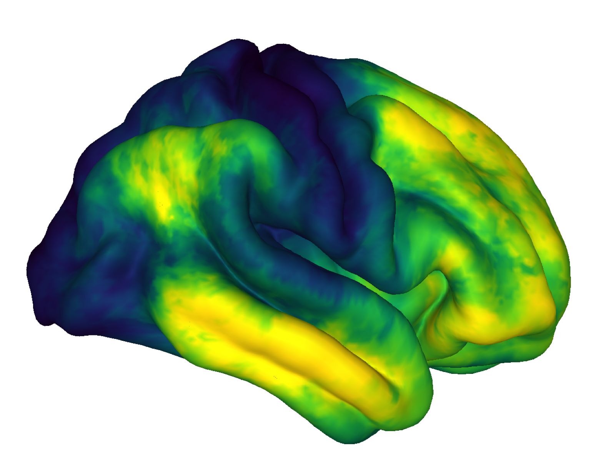
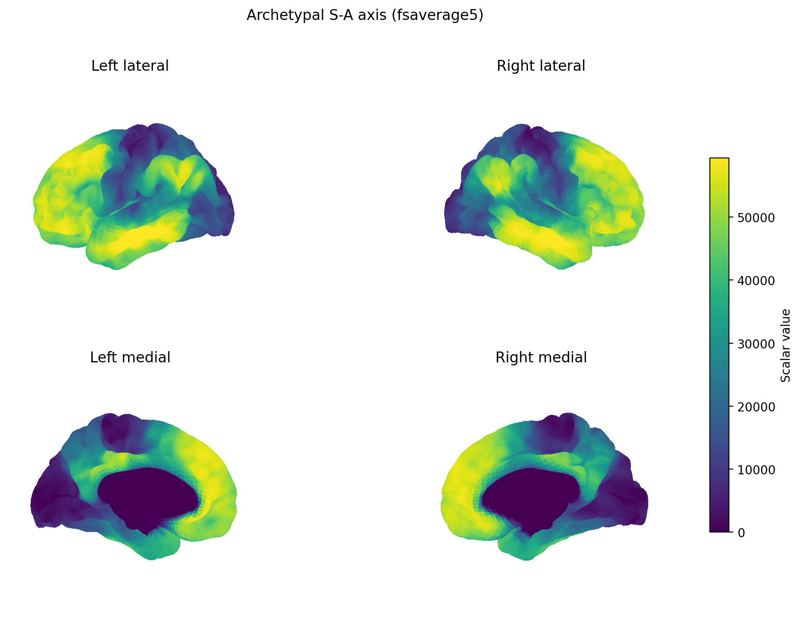

# Sydnor et al. 2021 - Archetypal S-A Axis

This study folder contains brain-map data for visualising the **archetypal sensorimotor-association (S-A) axis** from Sydnor et al. (2021). The S-A axis describes a broad cortical hierarchy running from **sensorimotor cortex** toward **association cortex**.

## Data in this folder

This local copy contains the S-A axis in two formats:

- `data/FSLRVertex/SensorimotorAssociation_Axis.dscalar.nii` - CIFTI dense scalar map for Cerebro rendering.
- `data/FSaverage5/SensorimotorAssociation_Axis_LH.fsaverage5.func.gii` - left hemisphere fsaverage5 surface metric.
- `data/FSaverage5/SensorimotorAssociation_Axis_RH.fsaverage5.func.gii` - right hemisphere fsaverage5 surface metric.

It also includes selected comparison maps:

- `data/FSLRVertex/T1T2ratio.dscalar.nii` - myelin-sensitive T1w/T2w ratio map.
- `data/FSLRVertex/Cortical.Thickness.dscalar.nii` - cortical thickness map.
- `data/FSLRVertex/G1.fMRI.dscalar.nii` - functional connectivity gradient map.

Use the **CIFTI** map for the main Cerebro view and the **GIFTI** files when you want explicit left/right fsaverage5 views.

## CIFTI visualisation (`sa_axis_cerebro.png`)



**What this image shows:** the S-A axis from `SensorimotorAssociation_Axis.dscalar.nii` rendered on the HCP-style cortical template through Cerebro.

- **Surface:** HCP/CIFTI cortical template, not an individual participant's anatomy.
- **Colour scale:** numeric values from the dense scalar map. Yellow is higher, purple is lower, and teal/green is intermediate.
- **Interpretation:** the map captures a broad sensorimotor-to-association cortical hierarchy. The important feature is the continuous axis across cortex; exact high/low biological labels should be checked against the source map polarity.

Reproduce it from the repository root:

```bash
cd "$(git rev-parse --show-toplevel)"

MPLBACKEND=Agg neuro-viewer \
  --dscalar "studies/Sydnor et al 21 - Archetypal S-A Axis/data/FSLRVertex/SensorimotorAssociation_Axis.dscalar.nii" \
  --offscreen \
  --output "studies/Sydnor et al 21 - Archetypal S-A Axis/figures/sa_axis_cerebro.png" \
  --colormap viridis
```

## GIFTI fsaverage5 visualisation (`sa_axis_fsaverage5.png`)



This figure uses the two `.func.gii` surface metric files. Each stores one scalar value per cortical surface vertex on the fsaverage5 mesh.

**What this image shows:** the archetypal S-A axis painted onto the left and right **fsaverage5** cortical surfaces.

- **Top left / top right:** lateral (outside) views of the left and right hemispheres.
- **Bottom left / bottom right:** medial (inside-facing) views of the left and right hemispheres.
- **Colour bar:** numeric scalar values from the two `.func.gii` files, using one shared scale across both hemispheres.
- **Interpretation:** this map represents a cortical axis running from **sensorimotor** regions toward **association** regions. The exact biological label for the high or low end depends on the source map's polarity, but the important feature is the continuous gradient across cortical organisation.

This is a **template/group surface visualisation**, not an individual participant's anatomy.

Reproduce it from the repository root:

```bash
cd "$(git rev-parse --show-toplevel)"

MPLBACKEND=Agg neuro-viewer \
  --func-gii-left "studies/Sydnor et al 21 - Archetypal S-A Axis/data/FSaverage5/SensorimotorAssociation_Axis_LH.fsaverage5.func.gii" \
  --func-gii-right "studies/Sydnor et al 21 - Archetypal S-A Axis/data/FSaverage5/SensorimotorAssociation_Axis_RH.fsaverage5.func.gii" \
  --mesh fsaverage5 \
  --output "studies/Sydnor et al 21 - Archetypal S-A Axis/figures/sa_axis_fsaverage5.png" \
  --title "Archetypal S-A axis (fsaverage5)" \
  --colormap viridis
```

## Suggested comparison renders

The copied comparison maps can be rendered individually with the same CIFTI workflow. For example:

```bash
MPLBACKEND=Agg neuro-viewer \
  --dscalar "studies/Sydnor et al 21 - Archetypal S-A Axis/data/FSLRVertex/T1T2ratio.dscalar.nii" \
  --offscreen \
  --output "studies/Sydnor et al 21 - Archetypal S-A Axis/figures/t1t2ratio_cerebro.png" \
  --colormap viridis
```
